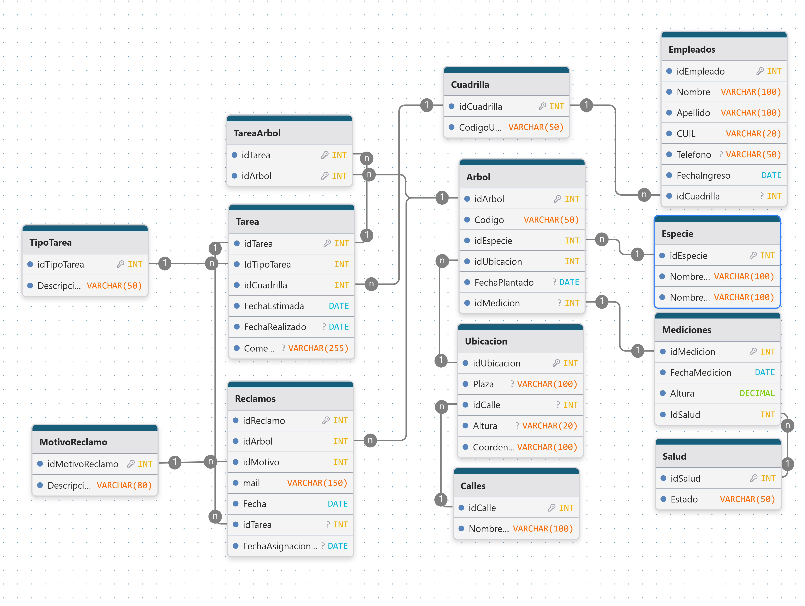

# Base de datos del arbolado público de Rosario (SQL Server)

Trabajo práctico grupal de dos integrantes. Bases de Datos I, Tecnicatura Universitaria en Inteligencia Artificial (FCEIA, UNR), 2025. Grupo G10.

[English version](README.en.md)

Diseñamos e implementamos en SQL Server la base de datos de la Dirección General de Parques y Paseos de Rosario. Modelamos 13 tablas en 3FN y escribimos los scripts de creación y de carga de datos de prueba. Sobre ese modelo armamos dos vistas, un procedimiento almacenado y cuatro consultas de negocio.

## Equipo

Este es un trabajo grupal de dos personas:

- Maximiliano Frank
- Federico Winter

Repositorio original del grupo: [winttita/TP-Final-BDDI](https://github.com/winttita/TP-Final-BDDI).

Este repositorio es una copia en la cuenta de Maximiliano Frank, reorganizada para mostrarla como portfolio. La autoría es del grupo.

## Escenario

La Dirección General de Parques y Paseos necesita informatizar la gestión del arbolado público. La base permite administrar:

- **Inventario de árboles:** especie, ubicación, estado de salud, altura y fecha de plantado.
- **Cuadrillas y empleados:** equipos de trabajo y sus integrantes, con datos de contacto y fecha de ingreso.
- **Tareas:** poda, extracción, plantado y otras, asignadas a una cuadrilla, con fecha estimada, fecha de realización y comentario.
- **Reclamos ciudadanos:** reclamos recibidos por mail, su motivo, la tarea que los resuelve y los tiempos de asignación y resolución.

## Modelo de datos



El modelo está en tercera forma normal. También se puede ver y editar en [drawdb](https://www.drawdb.app/editor?shareId=136ac6a3d8b99b33fd0cafe26ec6e197).

### Decisiones de diseño

- **Atributos únicos.** `Cuadrilla.Codigo`, `Arbol.Codigo` y `Empleados.CUIL` son únicos porque lo pedía el enunciado. Agregamos la misma restricción a `Especie.NombreCientifico`, `TipoTarea.Descripcion`, `Salud.Estado`, `MotivoReclamo.Descripcion` y `Calles.Nombre` para que los catálogos no tengan duplicados.
- **Mediciones 1:1 con Árbol.** La tabla guarda solo el estado actual del árbol (altura y salud), sin historial. Un árbol puede no tener medición (`idMedicion` admite `NULL`), lo que ahorra espacio en los árboles antiguos que no se midieron.
- **Tabla intermedia `TareaArbol`.** Una tarea puede aplicarse a muchos árboles, y un árbol puede recibir muchas tareas.
- **Empleado y cuadrilla.** Cada empleado pertenece a una sola cuadrilla y no se guarda el historial de cambios.
- **Reclamos y tareas.** Una tarea puede resolver varios reclamos, pero cada reclamo lo resuelve una sola tarea. Un reclamo sin tarea está sin asignar.
- **Ubicación.** Un árbol está en una plaza o parque, o en una calle con su altura. En casos poco frecuentes puede tener ambos datos. La base no obliga a elegir uno.

## Contenido

| Archivo | Qué hace |
|---|---|
| `sql/01_crear_tablas_vistas_procedimiento.sql` | Crea la base `TP_BBDD_G10`, las 13 tablas con sus claves y restricciones, las vistas y el procedimiento. |
| `sql/02_insertar_datos.sql` | Carga datos de prueba. |
| `sql/03_ejemplos_de_uso.sql` | Consultas de negocio y ejemplos de uso de las vistas y del procedimiento. |

**Datos de prueba:** 3 cuadrillas, 10 empleados, 50 árboles de 5 especies, 40 mediciones, 20 tareas (de octubre a diciembre de 2025) y 19 reclamos.

**Vistas:**

- `v_InfoReclamos`: tiempo de asignación y de resolución de cada reclamo.
- `v_TareasRealizadas`: primera y última fecha y cantidad de tareas realizadas por tipo.

**Procedimiento almacenado:** `sp_AnalizarTareasArbol(@idArbol, @idTipoTarea, @FechaProxima OUTPUT)`. Devuelve en el parámetro de salida la fecha de la próxima tarea pendiente del tipo indicado. Retorna como valor la cantidad de tareas pendientes.

**Consultas de negocio:**

1. Cuadrilla que más tareas realizó en octubre de 2025.
2. Motivos de reclamo con más de 3 reclamos sin tarea asignada.
3. Árboles sin ningún reclamo.
4. Los tres árboles más altos de cada especie.

## Tecnologías

- Microsoft SQL Server (T-SQL). El procedimiento usa `CREATE OR ALTER`, que necesita SQL Server 2016 SP1 o superior.
- SQL Server Management Studio (SSMS).
- [drawdb](https://www.drawdb.app/) para el diagrama.

## Estructura del repositorio

```
sql/                                          scripts de la base de datos
  01_crear_tablas_vistas_procedimiento.sql
  02_insertar_datos.sql
  03_ejemplos_de_uso.sql
assets/der_arbolado_publico.png               diagrama entidad-relación
README.md                                     este archivo
README.en.md                                  versión en inglés
```

## Cómo ejecutarlo

1. Abrir SSMS y conectarse a una instancia de SQL Server.
2. Ejecutar `sql/01_crear_tablas_vistas_procedimiento.sql`. Crea la base `TP_BBDD_G10` y todos sus objetos.
3. Ejecutar `sql/02_insertar_datos.sql`. Carga los datos de prueba.
4. Ejecutar `sql/03_ejemplos_de_uso.sql`. Corre las consultas, las vistas y el procedimiento.

Hay que respetar ese orden. Los scripts están guardados en UTF-8 con BOM para que SSMS muestre bien las tildes. El script 01 no borra la base si ya existe, así que para repetir la instalación hay que eliminar antes `TP_BBDD_G10`.

## Limitaciones

- Las fechas de las tareas de prueba son de 2025 y el procedimiento compara contra `GETDATE()`. Con una fecha actual posterior, el ejemplo del caso 1 devuelve `NULL` como fecha próxima, aunque el valor de retorno cuente tareas pendientes.
- En el procedimiento, la fecha próxima solo mira tareas con fecha estimada futura. La cantidad de pendientes incluye también las vencidas.
- La tabla `Mediciones` no guarda historial, así que no se puede ver cómo creció un árbol.
- No hay una restricción `CHECK` que obligue a que `Ubicacion` tenga plaza o calle.
- Hay pocos datos de prueba. Sirven para validar la lógica, no para medir rendimiento.
